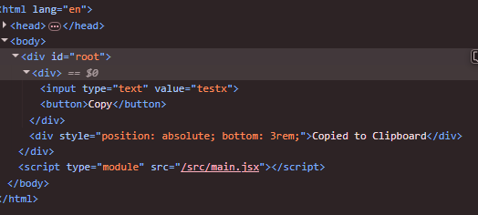
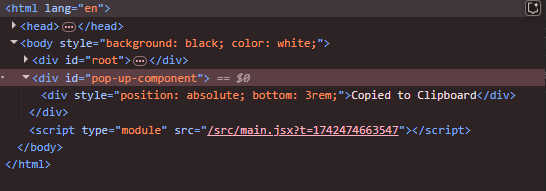

# React JS Day 5

## React JS Portals

- By default React JS renders components to only the root component in the dom, but if you want to render a component else where, you can make use of the react portal, which allows you to step out of the root component in the dom, and render elsewhere.

- In order to write to the clipboard, you can use the navigator.clipboard.writeText(), then you pass in the value.

- In order to make use of react portal, you have to import it from the react-dom

- import { createPortal } from "react-dom";

- The createPortal function takes two parameters, the content you want to render, and where you want to render the content.

- Then the next thing you do is to create the element where you want to render the React component inside your index.html file.

- Take this for example, by defaut the component we have created is rendered in the root element in our DOM.

- If we want to render it elsewhere, like in some other element in our DOM, that is where the createPortal component comes in.

- s => !s This means return the inversion of s, if s was true, false will be returned.

## The useEffect Hook

- The useEffect Hook allows you to perform side effects in your components. Some examples of side effects are: fetching data, directly updating the DOM, subscribing to events, managing timers etc.

- It runs after rendering, the dependency array controls when it runs. Can be used for cleanup e.g removing event listeners.

- useEffect(() => {

})

### Key points to note about useEffect hoook

- If you dont specify the dependency array, the useEffect hook will run on every single render.

- You cannot use useEffect inside a conditional statement, rather if you want to apply conditional logic, add the if statement inside the useEffect.

- If you add a dependency to the useEffect hook, anytime the state of the dependency changes, the callback function of the useEffect hook will fire.

#### We setup useEffect hook to run some code WHEN

- Component renders for the first time.

- whenever a component re-renders.

- some data in our component changed.

- using strict mode calls the useEffect twice.